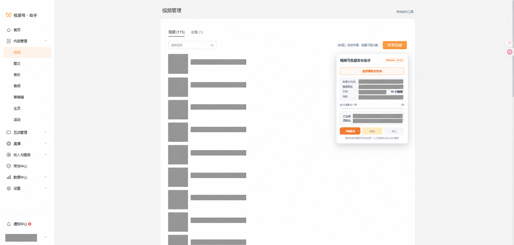

# 视频号批量发布助手

一个用于简化视频号助手后台重复发布操作的浏览器扩展，提供 Chrome 与 Microsoft Edge 两个版本。

它不会绕过登录或平台权限。使用者先人工登录并打开“视频管理”页面，再由扩展逐个完成视频上传、文案填写、短剧关联、内容标注和发表。

> 当前版本：`v1.2.0`
>
> 核心批量流程已完成 10 个视频连续发布实测。首次使用或网站改版后，请先用 1～3 个视频验证。



## 适用场景

- 同一部短剧有多个视频，需要重复填写相同文案并逐个发表。
- 视频号助手后台没有满足需求的批量发布入口。
- 希望自动关联与文件夹同名的“小程序短剧”或“视频号剧集”。
- 网络较慢，需要明确的等待、停止和错误提示。
- 自动搜索不到剧名时，希望保留现场并切换为人工选择。
- 部分视频需要人工编辑封面，但其他视频希望自动发表。

## 主要功能

- 从一个剧集文件夹读取多个视频并按文件名自然排序。
- 自动点击“发表视频”并上传当前视频。
- 视频描述、短标题、链接类型、搜索词和视频标注均可在开始前编辑，默认值沿用上一稳定版。
- 链接支持“小程序短剧”“视频号剧集”和“不关联链接”。
- 使用可编辑的搜索词搜索并关联剧集。
- 文件夹名为 `剪辑-剧名A`、`剪辑－剧名A` 或 `剪辑—剧名A` 时，自动去掉前缀并搜索 `剧名A`。
- 视频标注默认选择“含AI生成内容”，也可在开始前改为其他支持项或“不设置”。
- 可选自动声明原创；自动步骤失败时保留现场并等待人工完成。
- 网站确认视频处理完成且“发表”按钮可用后再发表。
- 自动搜索不到唯一剧名时暂停，人工选择后点击“继续”恢复。
- 提供可选的“发布前人工编辑封面”，默认关闭。
- 运行中可随时点击“下次发表前暂停并人工检查”；下一次即将发表时暂停一次，继续后不审查人工修改，直接点击发表。
- 发布设置保存在当前浏览器，批次运行期间锁定。
- 显示来源文件夹、搜索剧名、当前文件、批次进度和运行状态。
- 助手面板可拖动，并保存上次位置。
- 等待过程中不会重复点击同一个按钮，“停止”保持快速响应。

## 安装

### 方法一：下载正式包（推荐）

进入仓库右侧的 **Releases**，下载对应浏览器的 ZIP：

- Chrome：`video-batch-assistant-chrome-v1.2.0.zip`
- Edge：`video-batch-assistant-edge-v1.2.0.zip`

下载后先完整解压，不能直接从 ZIP 内加载。

#### Chrome

1. 地址栏打开 `chrome://extensions`。
2. 开启右上角“开发者模式”。
3. 点击“加载已解压的扩展程序”。
4. 选择 Chrome ZIP 解压后的目录。
5. 扩展列表中确认版本号为 `1.2.0`。

#### Microsoft Edge

1. 地址栏打开 `edge://extensions`。
2. 开启“开发人员模式”。
3. 点击“加载解压缩的扩展”。
4. 选择 Edge ZIP 解压后的目录。
5. 扩展列表中确认名称包含 `Edge`，版本号为 `1.2.0`。

### 方法二：从源码构建

Windows PowerShell 中执行：

```powershell
./scripts/build.ps1
```

构建产物会写入 `dist/`，包括 Chrome 和 Edge 两个 ZIP。

## 使用方法

1. 登录视频号助手，人工进入“内容管理 → 视频”的视频管理列表。
2. 点击浏览器工具栏中的扩展图标，打开批量发布助手。
3. 点击“选择剧集文件夹”，选择只属于同一剧集的文件夹。
4. 检查面板中的：
   - 来源文件夹；
   - 去除 `剪辑-` 后的搜索剧名；
   - 视频数量；
   - 文件名排序。
5. 在“本批次发布设置”中核对或修改：
   - 视频描述；
   - 短标题；
   - 链接类型；
   - 搜索词；
   - 视频标注。
6. 根据需要勾选：
   - “自动声明原创”；
   - “发布前人工编辑封面”。
7. 人工封面选项的行为：
   - 不勾选：视频准备完成后自动发表；
   - 勾选：每个视频发表前暂停，编辑并保存封面后点击“继续”。
8. 点击“开始发布”。
9. 保持页面和浏览器窗口开启，等待批次完成。

设置会保存在当前浏览器的网站本地存储中。选择新文件夹时，搜索词会重新按文件夹名称生成，你仍可在开始前修改。

### 搜索不到剧名时

“小程序短剧”或“视频号剧集”在等待时间内没有得到唯一匹配项时，脚本不会关闭弹窗，也不会跳过当前视频：

1. 面板变成黄色人工接管状态。
2. 在网站剧集弹窗中修改关键词并人工选择正确结果。
3. 回到助手面板点击“继续”。
4. 扩展检测到已选短剧后继续设置标注和发表。

如果尚未选择剧集就点击“继续”，助手会继续等待，不会误发。

### 原创声明

该功能默认关闭。启用“自动声明原创”后，扩展会：

1. 勾选发表页中的原创声明入口；
2. 在“原创权益”弹窗中勾选协议；
3. 等待“声明原创”按钮可用后点击；
4. 自动定位失败时暂停，由人工完成后点击助手的“继续”。

是否符合原创条件必须由使用者自行判断。扩展只执行勾选操作，不判断内容权属。

### 人工编辑封面

该功能默认关闭。如果开始批次前勾选了“发布前人工编辑封面”：

1. 每个视频和表单全部准备完成后暂停。
2. 在网站中编辑并保存封面。
3. 点击助手面板“继续”。
4. 扩展重新检查“发表”按钮后再发表。

人工等待没有超时限制，可以随时点击“停止”。批次开始后不能中途修改封面选项。

### 运行中预约下一次发表前人工检查

批次开始后，“下次发表前暂停并人工检查”按钮才会启用。它是运行时的一次性按钮，不是开始前的批次设置：

1. 脚本运行期间随时点击该按钮；
2. 脚本继续完成当前自动步骤，在下一次即将点击“发表”时暂停；
3. 可人工修改描述、短标题、链接、标注、原创声明或封面；
4. 修改完成后点击助手的“继续”；
5. 扩展不比较、不恢复也不审核人工修改，只取得当前可点击的“发表”按钮并点击；
6. 本次预约随即清除，后续恢复自动发表；需要再次暂停时重新点击按钮。

如果人工修改导致网站“发表”按钮不可用，扩展无法强制发表，并会给出暂停信息。

如果批次已开启“人工编辑封面”，同时又预约了下一次全面检查，该视频只在全面检查阶段暂停一次，可一并完成封面编辑。

## 文件夹与排序规则

- 一次只选择一个剧集文件夹。
- 视频支持常见格式：MP4、M4V、MOV、WebM 等浏览器可识别的视频格式。
- 文件按自然顺序排列，例如 `2.mp4` 会排在 `10.mp4` 前。
- 建议使用固定宽度编号：`001.mp4`、`002.mp4`、`003.mp4`。
- 文件夹名默认作为短剧搜索词。
- `剪辑-`、`剪辑－`、`剪辑—` 前缀会被移除；本地文件夹不会被重命名或修改。

## 等待时间

| 阶段 | Chrome | Edge |
|---|---:|---:|
| 普通页面及弹窗 | 30 秒 | 40 秒 |
| 视频列表 frame | 15 秒 | 25 秒 |
| 视频上传和处理 | 90 秒 | 100 秒 |
| 发表后返回列表 | 90 秒 | 100 秒 |

常规等待上限较上一版方案增加 50%，同时继续保持 Edge 比 Chrome 多 10 秒。人工选择剧集、人工完成原创声明、人工编辑封面和发表前人工检查均不设超时。

## 浏览器权限与隐私

扩展清单仅申请：

- `activeTab`：只在使用者主动点击扩展后访问当前标签页。
- `scripting`：将自动化逻辑注入当前视频号助手页面及同源 frame。

项目不包含服务器端代码，不上传账号、Cookie、视频或文件夹信息，不收集统计数据。视频文件由浏览器直接交给当前已登录的视频号助手页面。

## 注意事项

- 本项目是非官方辅助工具，与腾讯、微信或视频号不存在隶属、授权或合作关系。
- 请遵守平台规则、版权要求和所在地法律法规，并自行承担账号与内容发布责任。
- 扩展依赖页面 DOM（文档对象模型）结构；网站改版后可能需要更新定位规则。
- 首次使用、新版本升级或网站改版后，先用少量视频测试。
- 批次运行期间不要关闭标签页、刷新页面、退出登录或切换账号。
- 发布前确认剧集、视频标注、原创声明、文案和封面符合实际内容。
- 浏览器刷新后不会恢复未完成队列，请重新选择文件夹并核对已发布记录，避免重复发布。
- 封面人工选项默认关闭；需要逐条编辑封面时必须在开始批次前勾选。
- 原创声明默认关闭；只有确认内容符合平台原创要求时才可启用。
- 运行中预约的人工检查在“继续”后不会审查人工改动，请在点击“继续”前自行核对。
- 自动化不能替代人工审核。涉及版权、广告、虚构剧情、转载或其他标注时，请按平台要求补充正确声明。

## 常见问题

### 点击扩展图标没有出现面板

确认当前页面是视频号助手页面，并在扩展管理页确认扩展已启用。刷新视频管理页后再次点击扩展图标。

### 找不到“发表视频”按钮

确认已经进入“内容管理 → 视频”的列表页。关闭网站自身可能遮挡页面的提示弹窗，然后重试。

### 视频上传后没有继续

等待网站完成上传与处理。超过对应浏览器时限后，复制面板中的完整诊断信息提交 Issue。

### 描述在编辑页显示，但发布后没有出现

`v1.1.0` 起改为在页面 MAIN world（主执行环境）写入富文本状态，并延迟确认内容。如果仍出现，请提供浏览器版本、扩展版本、暂停信息和脱敏截图。

### 如何移动助手

按住面板顶部标题栏拖动。位置会保存在当前网站的本地存储中。

## 问题反馈

提交 Issue 前请准备：

- Chrome 或 Edge 的完整版本号；
- 扩展版本号；
- 面板中的完整暂停/诊断文字；
- 问题发生在哪个步骤；
- 已对账号、剧名、文件名、视频画面等信息打码的截图。

请勿提交 Cookie、会话 ID、手机号、个人身份信息、未公开视频或未脱敏业务数据。

## 项目结构

```text
.
├─ background.js              # 后台脚本、frame 扫描、MAIN world 描述写入
├─ content.js                 # 面板、队列和发布流程
├─ manifest.json              # Chrome 清单
├─ manifest.edge.json         # Edge 清单
├─ scripts/build.ps1          # 双浏览器构建脚本
├─ docs/images/overview.png   # 已脱敏项目截图
└─ .github/ISSUE_TEMPLATE/    # 问题反馈模板
```

## 开发与验证

```powershell
node --check ./content.js
node --check ./background.js
./scripts/build.ps1
```

每次修改建议至少验证：单视频完整流程、多个视频循环、两种链接类型、剧集人工接管、原创声明、封面开关、发表前人工检查、停止按钮以及 Chrome/Edge 等待差异。

## 许可证

项目使用 [MIT License](LICENSE)。
